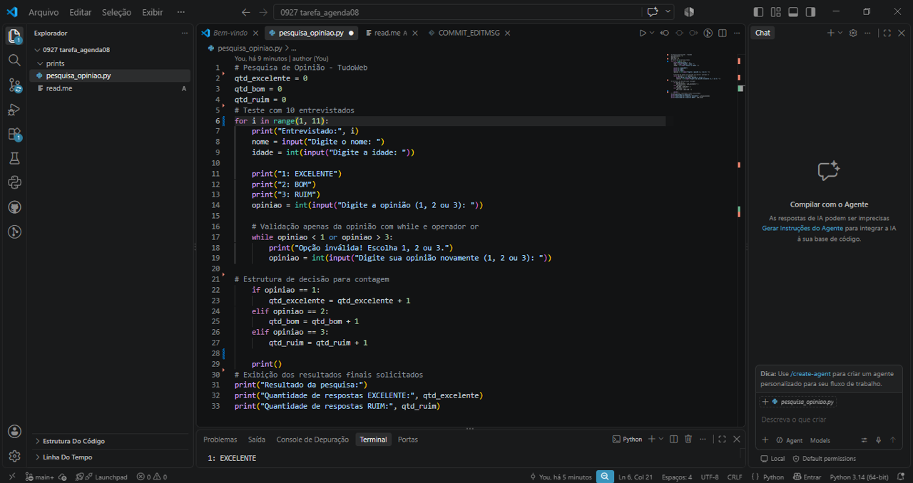
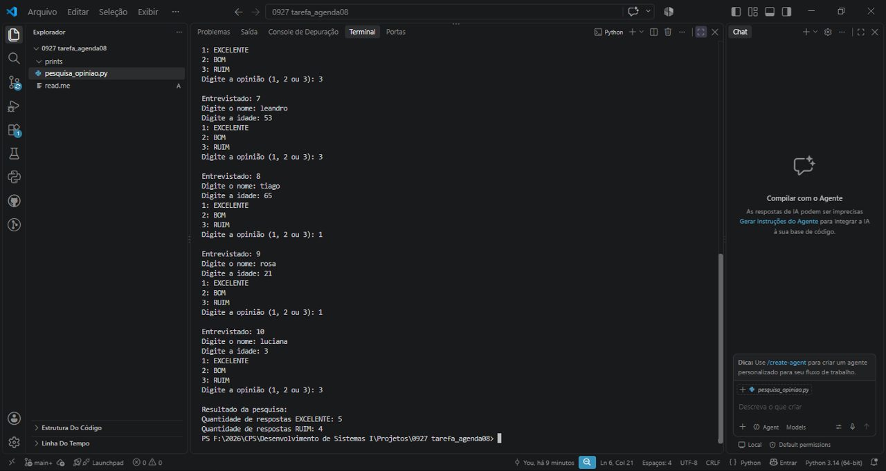

# Pesquisa de Opinião - TudoWeb

Atividade da Agenda 08 - Desenvolvimento de Sistemas I.

## Descrição
Programa desenvolvido em Python utilizando estruturas de repetição (`for` e `while`) e estruturas de decisão (`if/elif`) para coletar e apurar dados de atendimento ao cliente.

## Testes Realizados

### Código-Fonte

### Execução e Resultados
